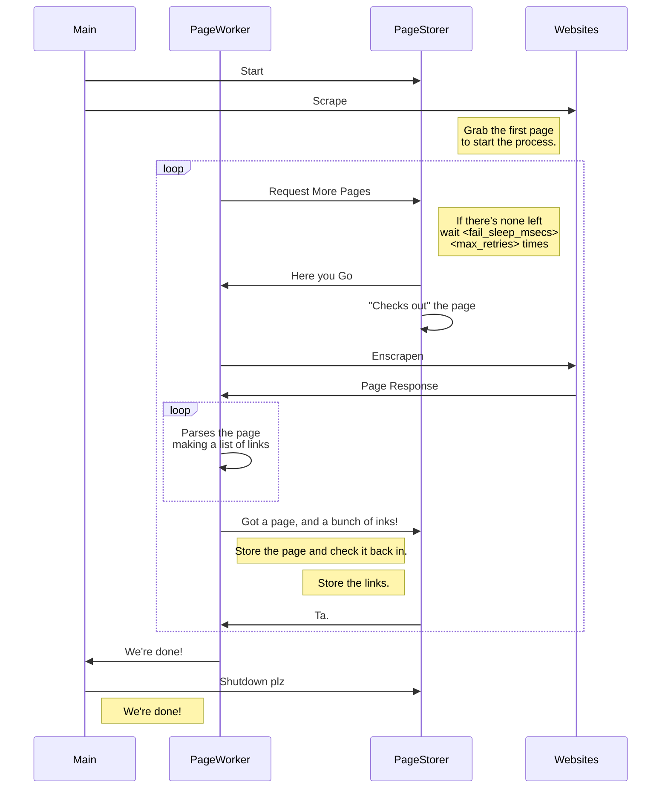

# link-finder

Yet another web-site-parsing thing that looks for dead links.

The *worker* will treat every URL as distinct, but the backend will strip anchors out (`#blah`) to reduce re-scrapes.

## Usage

This might be out of date, run `link-finder --help` to be sure 😁

```text
Usage: link-finder [OPTIONS] <URL>

Arguments:
  <URL>  The URL to start from

Options:
  -H, --host <HOST>
          Limit the hosts you want to scrape, by default the host in the URL is included
  -i, --include-generic
          If you want to check images and other things we *know* aren't pages.
  -q, --quiet
  -d, --debug
  -m, --max-retries <MAX_RETRIES>
          The maximum amount of times the scraper will loop waiting for a page to process [default: 5]
  -f, --fail-sleep-msecs <FAIL_SLEEP_MSECS>
          The time the scraper will wait for a page to process [default: 250]
  -s, --status-update-secs <STATUS_UPDATE_SECS>
          Number of seconds between status updates from the backend [default: 3]
  -h, --help
          Print help
  -V, --version
          Print version
```

## Process flow


